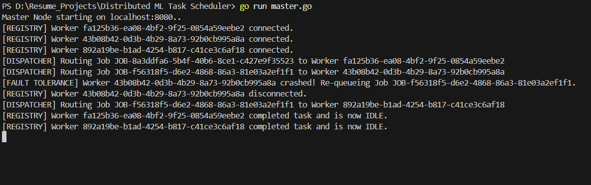
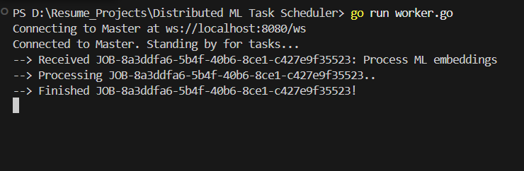
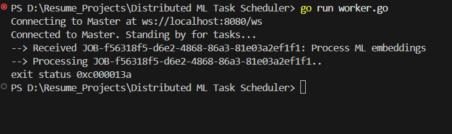
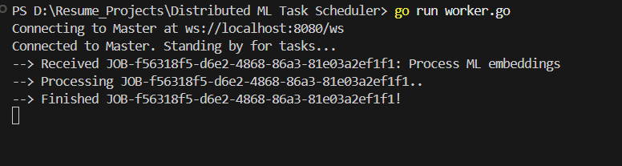

# Distributed ML Task Scheduler

A lightweight, distributed task scheduling system built in Go.

## Features

- Built a distributed task scheduling system in Go using a master-worker topology communicating via bidirectional WebSockets.
- Designed a round-robin load balancer and a dynamic worker registry to seamlessly route incoming ML and data-processing jobs.
- Enabled concurrent task execution across multiple workers with fault-tolerant scheduling and automatic worker registration.

## Architecture

```mermaid
flowchart LR
    %% Custom Styles for a clean, professional look
    classDef master fill:#e3f2fd,stroke:#1565c0,stroke-width:2px,color:#000;
    classDef worker fill:#e8f5e9,stroke:#2e7d32,stroke-width:2px,color:#000;
    classDef queue fill:#fff3e0,stroke:#e65100,stroke-width:2px,color:#000;
    classDef client fill:#f3e5f5,stroke:#6a1b9a,stroke-width:2px,color:#000;
    classDef fault fill:#ffebee,stroke:#c62828,stroke-width:2px,stroke-dasharray: 5 5,color:#000;

    Client([Client / API Request]):::client -->|"HTTP POST /submit"| JobQueue

    subgraph MasterNode["Master Node (Load Balancer & State)"]
        direction TB
        JobQueue[("Job Queue<br/>(Go Channel)")]:::queue
        Dispatcher(("Round-Robin<br/>Dispatcher")):::master
        Registry[("Worker Registry<br/>(RWMutex Map)")]:::master
        Ledger[("Active Jobs Ledger<br/>(State Tracking)")]:::master

        JobQueue ==>|"1. Pull Task"| Dispatcher
        Registry -.->|"2. Check Idle/Busy"| Dispatcher
        Dispatcher -->|"3. Log Assignment"| Ledger
    end

    subgraph WorkerCluster["Worker Node Cluster"]
        direction TB
        W_Idle["Worker Node 1<br/>[Status: IDLE]"]:::worker
        W_Busy["Worker Node 2<br/>[Status: BUSY]"]:::worker
        W_Crash["Worker Node 3<br/>[CRASHED]"]:::fault
    end

    %% Outbound Dispatching
    Dispatcher ===>"4. WS Dispatch JSON"===> W_Idle

    %% Inbound Acknowledgments (Happy Path)
    W_Busy -.->|"5. WS 'DONE' Ack"| Registry
    Registry -.->|"6. Clear Ledger Entry"| Ledger

    %% Fault Tolerance Loop (Edge Case)
    W_Crash -.-x|"7. WebSocket Drops"| Registry
    Registry --"8. Fetch Orphaned Job"--> Ledger
    Ledger =="9. Re-queue Failed Job"==> JobQueue
```

## How to Run Locally

You can run the system using the provided PowerShell script or standard Go commands.

**1. Start the Master Node:**
Open a terminal and start the master server:
```bash
./run.ps1 master
# or
go run master.go
```
The master node will start listening for worker connections and API requests on `localhost:8080`.

**2. Start Worker Nodes:**
Open multiple separate terminal windows and run a worker in each:
```bash
./run.ps1 worker
# or
go run worker.go
```

**3. Submit a Job:**
In another terminal window, submit a job using `curl`:
```bash
curl http://localhost:8080/submit
```

## Demo & Proof of Execution

Below is a demonstration of the system in action, showcasing automatic worker registration, job routing, and fault-tolerant scheduling.

### 1. Master Node Initialization
The Master Node initializes the job queue, worker registry, and active jobs ledger, then begins listening on port `8080`.


### 2. Worker Registration (A, B, C)
Three separate worker nodes are spun up. They automatically connect to the master node via WebSockets and register themselves as idle and ready for work.

### 3. Job Execution (Happy Path)
A client submits a job to the master node using `curl /submit`. The round-robin dispatcher assigns this task to the first available node (Worker A). Worker A processes the simulated ML job and successfully sends a "DONE" acknowledgment back to the Master.


### 4. Fault Tolerance (Worker Crash & Re-queue)
A second job is submitted using `curl /submit`. 
- The load balancer assigns this task to **Worker B** using round-robin.
- While processing the job, **Worker B crashes** (or is forcefully terminated), and the WebSocket connection drops. 

- The Master Node detects the broken connection, checks the Active Jobs Ledger, and realizes Worker B died while handling an active job.
- The Master **re-queues** the orphaned job immediately.
- **Worker C**, being the next available idle node, picks up the re-queued job and successfully completes it.
